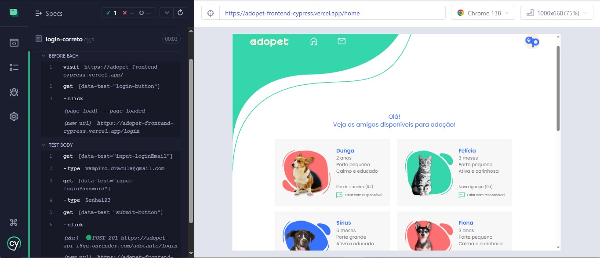
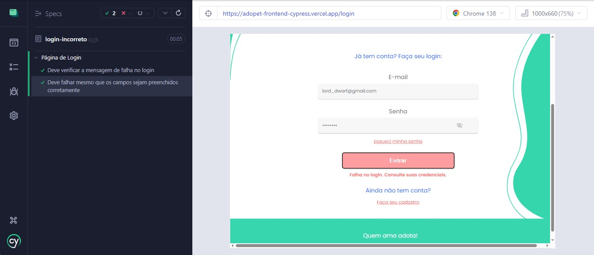
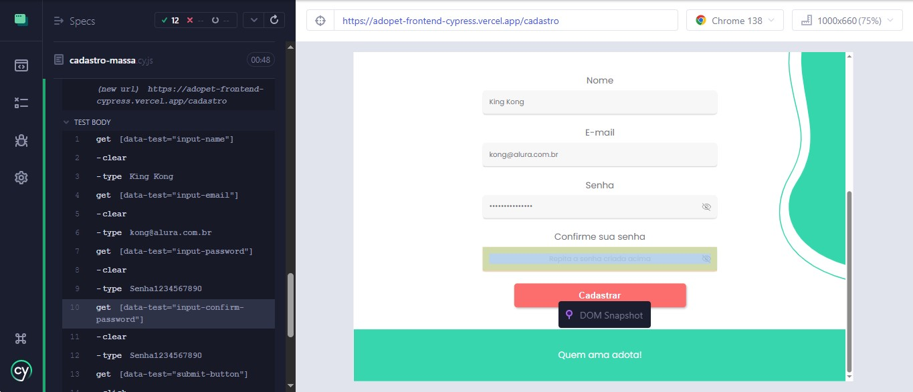

> <h2>Table of Contents</h2>

<ul>
  <li>About</li>
  <li>Technologies</li>
  <li>A Bit About the Project</li>
  <li>Installation</li>
</ul>

## About

  

  This project aims to automate end-to-end tests using the Cypress framework, applied to a simulated web application (Adopet). Throughout the project, test scenarios were implemented to cover both positive and negative cases, form validations, authentication, and API request simulations, with a strong focus on quality, maintainability, and test organization. 

## Technologies
<ul>
	<li>Cypress</li>
	<li>JavaScript</li>
	<li>Mochawesome (for report generation)</li>
  <li>Cypress Cloud (for publishing test documentation)</li>
  <li>Node.js</li>
</ul>

## A Bit About the Project

 > ### Automating Test Scenarios
  
 This project showcases how Cypress simplifies test automation with its visual interface, allowing real-time test execution tracking, easy debugging, and greater efficiency in validating scenarios..

  
  

 > ### Test Double
  
 The concept of test doubles (stubs) was used to simulate behaviors and API responses, allowing the tests to be isolated from external dependencies. This approach ensures greater reliability and speed when executing automated tests.

  
  

  > ### Test Data in Automation
  
 Automation was structured using fixtures, enabling practical and reusable test data management. This includes the creation of multiple user profiles used to validate different application flows and ensure full scenario coverage.

  
  

## Installation

To use this project, you need to have Node.js installed in the LTS version.

  ### Installing dependencies
  
    npm install  
    
    npm install cypress@13.6.4 --save-dev  
    
    npm install --save-dev mochawesome  

  ### In the project directory, you can run:

 `npx cypress open`
